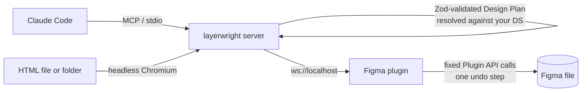

# Layerwright

**Turn Claude Design and Claude Code designs into native, editable Figma files.**

Layerwright is an open-source MCP server and Figma plugin that works with Claude Code. It imports
HTML (for example a Claude Design "standalone HTML" export) into Figma as real frames with Auto
Layout, text, images and vector icons, and it lets Claude build new screens from your own Design
System: real component instances, variables and text styles. It is not a screenshot and it is not a
flat SVG.

[](https://github.com/shayan-m81/layerwright/actions/workflows/ci.yml)
[](https://www.npmjs.com/package/layerwright)
[](https://github.com/shayan-m81/layerwright/blob/main/LICENSE)


## Why

Claude Design exports to HTML, PDF, PPTX and Canva, but not to Figma. Claude Code can write UI code,
but it has no native way to put a design into a Figma file your team can edit. Most "HTML to Figma"
tools either paste a flat picture or need a cloud account.

Layerwright closes that gap locally:

- **Claude Design to Figma:** export standalone HTML, run one command, and you get editable Figma frames.
- **Claude Code to Figma:** ask Claude for a screen or a flow, and it is built from your Design System's components.
- **No API keys, no cloud, no account.** Everything runs on your machine. The plugin only talks to `localhost`.

## Features

- **HTML to Figma import** (`import_html_to_plan`)
  - Flexbox becomes Auto Layout: direction, gap, padding, alignment and wrap.
  - Colours, borders, radii, shadows, gradients, fonts, line height and letter spacing come across.
  - Images and inline SVG icons are imported as real images and vectors.
  - Desktop (1440) and mobile (390) screens are rendered side by side.
  - RTL is supported (Persian, Arabic, Hebrew). Rows keep their visual order and text stays right-aligned.
- **Design System automation.** Buttons, inputs and links in the HTML are swapped for your real Figma components after a Design System scan.
- **AI design to Figma from a prompt.** Claude writes a typed Design Plan (a JSON DSL). The plan is validated and resolved against your components, variables and text styles, then built deterministically. Claude never writes Figma plugin code.
- **Safe by default.**
  - Every run is one undo step.
  - A failed run rolls back completely.
  - Results are checked against the plan.
  - Existing nodes change only after you approve.
- **Audit and fix existing frames.** Hard-coded colours become variables, raw text gets text styles, and custom buttons become component instances. Originals are hidden, never deleted.
- **Design to code.** Map Figma components to your React components and check that the implementation uses them.
- **Pixel-faithful mode** (`figma_import_html`) for review boards and art-heavy pages: exact layers, variant sets built from states, and instance swaps.

## Quickstart (3 steps)

Requirements: Node.js 20+, Figma desktop, Claude Code.

```bash
# 1. In your project folder
npx layerwright init
```

2. In **Figma desktop**, go to **Plugins → Development → Import plugin from manifest…** and pick the path `init` printed (`~/.layerwright/figma-plugin/manifest.json`). Open your file and run **Layerwright**. Keep its small window open.
3. Restart **Claude Code** in the project and ask:
   - *"Import ./design.html into Figma"*: a Claude Design HTML export becomes editable frames.
   - *"Create a sign-up flow in Figma using our Design System"*: new screens built from your components.
   - Select a frame in Figma, then *"Implement the selected Figma frame in code using our components"*: Figma → code with your mapped React components and theme tokens, checked afterwards.

Want these rules always in Claude's context? Paste [this prompt](https://github.com/shayan-m81/layerwright/blob/main/docs/claude-prompt.md) into your project's `CLAUDE.md`.

Something not working? Run `npx layerwright doctor`.

For HTML import, Layerwright needs a Chromium. It uses Google Chrome if you have it installed. Otherwise run `npx playwright install chromium`.

Want to try the conversion without Figma? `npx layerwright import ./design.html` prints what would be built.

## How it works



1. **Plan.** Claude, or the HTML importer, produces a **Design Plan**: a small, typed JSON DSL of screens, frames, text, components, tokens and images.
2. **Validate and resolve.** The server checks the plan with Zod. It then resolves every component, variant, property, variable and text style against a cached scan of *your* Figma file. Unknown names come back as errors with suggestions and never reach Figma.
3. **Execute.** The plugin builds the resolved plan with fixed Plugin API calls. There is no `eval` and no model-written code.
4. **Verify.** The result is re-inspected and compared with the plan.

Read more in [docs/architecture.md](https://github.com/shayan-m81/layerwright/blob/main/docs/architecture.md). The DSL is documented in [docs/dsl.md](https://github.com/shayan-m81/layerwright/blob/main/docs/dsl.md).

## MCP tools

| Tool | What it does |
|---|---|
| `import_html_to_plan` | HTML file or folder → editable Design Plan (Auto Layout, DS components). Returns a `planId` |
| `figma_execute_plan` | Builds a plan in Figma: one undo step, rollback on failure, automatic verification |
| `figma_preview_plan` | Validates and resolves a hand-written plan and returns a summary |
| `figma_status` / `figma_scan_design_system` / `figma_get_design_context` | Connection, Design System scan (components, variants, variables, styles), task-scoped context |
| `figma_inspect` / `figma_verify` / `figma_select` | Compact snapshots, plan-vs-canvas checks, select and zoom |
| `figma_analyze_design` / `figma_apply_transformations` | Audit a frame against the DS and apply approved fixes |
| `figma_import_html` / `figma_pages` / `figma_foundations` | Pixel-faithful import, page setup, variables and text styles |
| `code_scan_components` / `code_mapping` / `code_verify_usage` | Design to code: component mapping and usage checks |

## FAQ

**Is this an official Anthropic or Figma product?**
No. It is an independent open-source project that works with Claude Code and Figma.

**Does it need an API key, an account or a server?**
No. Claude Code runs the MCP server locally, and the Figma plugin connects to it on `localhost`. Nothing is uploaded.

**Can I use it without Claude Code?**
Yes, partly. `npx layerwright import` converts HTML to a plan from the command line, and any MCP client can call the tools. The skill and the workflow are written for Claude Code.

**Does the output use Auto Layout?**
Yes, where the HTML uses flexbox or evenly spaced stacks. Grid and overlapping layers become frames with absolutely positioned children, so the result still looks right.

**Will it use my Design System?**
Yes. Scan the file that has your components (`figma_scan_design_system`), and imported buttons, inputs and links become instances of them. Anything that doesn't match stays a styled frame.

**Does it work with right-to-left languages?**
Yes. Direction, text alignment and row order are preserved. Fonts such as Vazirmatn are matched to their real style names.

**Does it work in the Figma browser app?**
Development plugins need Figma desktop.

## Troubleshooting

Start with `npx layerwright doctor`. It checks Node, `.mcp.json`, the skill, the plugin files, the running server, the plugin connection and Chromium, and it prints a fix for each problem. More cases are covered in [docs/troubleshooting.md](https://github.com/shayan-m81/layerwright/blob/main/docs/troubleshooting.md).

## Limitations

- CSS grid, floats and transforms are imported as positioned layers, not as Auto Layout.
- Only linear gradients are supported. Radial and conic gradients, filters and blend modes are dropped in plan mode (the pixel-faithful mode keeps blend modes).
- The largest corner radius is used when the four corners differ.
- Fonts must be installed on the machine that runs Figma. A missing family falls back to Inter, with a warning.
- Images must be PNG, JPEG or GIF (a Figma limit), up to 10 MB each.
- Library components are found only when an instance of them exists in the open file.
- Verification is structural, not visual.
- One Figma plugin connection per port. Parallel sessions need separate ports (`LAYERWRIGHT_PORT`).

## Roadmap

- Per-corner radii, CSS grid → Auto Layout wrap, radial gradients
- Visual diff (screenshot) verification
- Design tokens export (W3C format) and import
- Figma Community listing ([plan](https://github.com/shayan-m81/layerwright/blob/main/docs/figma-community-plan.md))
- Instance-swap properties and nested overrides

## Contributing

Issues and pull requests are welcome. See [CONTRIBUTING.md](https://github.com/shayan-m81/layerwright/blob/main/CONTRIBUTING.md). To develop from a clone:

```bash
git clone https://github.com/shayan-m81/layerwright && cd layerwright
npm install && npm run build && npm test
npx tsx apps/mcp-server/src/cli.ts init   # wires this checkout into the current folder
```

## License

[MIT](https://github.com/shayan-m81/layerwright/blob/main/LICENSE) © Shayan Montazeri

---

*Keywords: claude design to figma, export claude design, claude code figma, html to figma, figma mcp, ai design to figma, design system automation.*

Not affiliated with, endorsed or sponsored by Anthropic or Figma. Claude is a trademark of Anthropic; Figma is a trademark of Figma, Inc.
